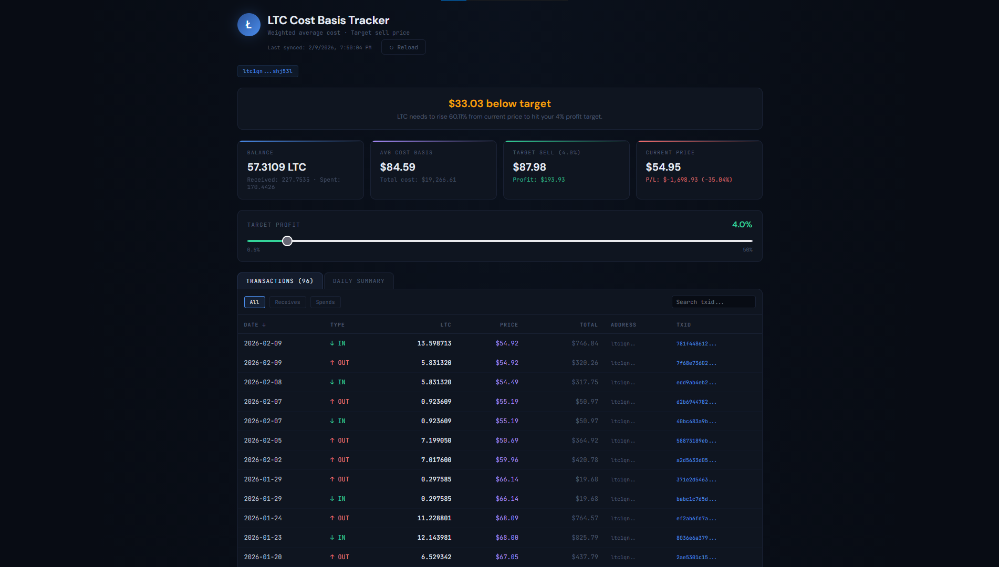

# ₿ LTC Cost Basis Tracker

A **free, local, privacy-focused** cost basis tracker for Litecoin. No accounts, no API keys, no data sent anywhere except public blockchain APIs.

Paste your LTC addresses → the tool auto-fetches all your transactions, records the price at the time of each one, and tells you exactly **at what price you need to sell to hit your profit target**.



---

## Why This Exists

If you receive LTC regularly (mining, payments, etc.), it's hard to know your real cost basis across hundreds of transactions at different prices. Services like Koinly and CoinTracker do this, but they cost money, require linking exchange accounts, and store your data on their servers.

This tool:
- ✅ **Runs 100% locally** — your addresses never leave your machine
- ✅ **Free forever** — uses only free public APIs (no keys needed)
- ✅ **Auto-syncs** — just run the script, it fetches everything
- ✅ **Handles internal transfers** — moving LTC between your own addresses won't mess up the math
- ✅ **Tracks spends** — if you spend LTC, it adjusts your balance and cost basis
- ✅ **Verifies itself** — cross-checks calculated balance against on-chain balance

---

## Quick Start

### Prerequisites

- Python 3.8+
- `pip` (comes with Python)

### Installation

```bash
# Clone the repo
git clone https://github.com/YOUR_USERNAME/ltc-cost-basis-tracker.git
cd ltc-cost-basis-tracker

# Install dependencies
pip install -r requirements.txt
```

### First Run

```bash
python tracker.py
```

On first run, the tool walks you through setup interactively:

```
=======================================================
  LTC Cost Basis Tracker — First Time Setup
=======================================================

  Paste your LTC addresses one by one.
  Press Enter on an empty line when done.

  Address #1 (or Enter to finish): ltc1q...
  [✓] Added (1 total)

  Address #2 (or Enter to finish): ltc1q...
  [✓] Added (2 total)

  Address #3 (or Enter to finish):

  Target profit % [default: 3]: 3
  Currency [default: usd]: usd

  [✓] Config saved to config.json
  [i] Tracking 2 address(es) with 3.0% target
```

It then fetches your transactions and shows a summary:

```
=======================================================
  SUMMARY
=======================================================
  Balance (calculated): 308.1234 LTC
  Balance (on-chain):   308.1234 LTC
  ✅ Balances match

  Avg Cost Basis:       $72.45
  Target Sell (3.0%):   $74.62
  Current Price:        $53.20
  Portfolio Value:      $16,392.17
  Unrealized P/L:       -$5,937.12 (-26.59%)

  ⏳ $21.42 below target (40.3% needed)

  → Open dashboard.html in your browser
=======================================================
```

### View Dashboard

Open `dashboard.html` in your browser — it works offline, no server needed.


Features:
- **Summary cards** — balance, avg cost, target sell price, current P/L
- **Adjustable profit target** — slide from 0.5% to 50% and see the sell price update
- **Transaction log** — sortable, filterable, with links to block explorer
- **Daily summary** — net LTC received/spent per day with prices

---

## Updating

Just run the script again whenever you want fresh data:

```bash
python tracker.py
```

- **Incremental sync** — only fetches transactions from new blocks since last run
- Historical prices are fetched once per date and cached forever
- Current price is always refreshed
- Typically takes just a few seconds after the initial sync

### Automate It

**Linux/Mac (cron):**
```bash
crontab -e
# Run every 6 hours
0 */6 * * * cd /path/to/ltc-cost-basis-tracker && python3 tracker.py >> tracker.log 2>&1
```

**Windows (Task Scheduler):**
1. Open Task Scheduler → Create Basic Task
2. Trigger: Daily, repeat every 6 hours
3. Action: Start a program → `python` with arguments `tracker.py`
4. Start in: `C:\path\to\ltc-cost-basis-tracker`

---

## Configuration

Edit `config.json` to change settings:

```json
{
  "addresses": [
    "ltc1q...",
    "ltc1q...",
    "Labc..."
  ],
  "target_profit_percent": 3.0,
  "currency": "usd",
  "max_transactions_per_address": 500
}
```

| Field | Description | Default |
|---|---|---|
| `addresses` | Your LTC addresses (any number) | — |
| `target_profit_percent` | Minimum profit target | `3.0` |
| `currency` | Fiat currency for prices | `"usd"` |
| `max_transactions_per_address` | Max txs to fetch per address on first run | `500` |

### Reset Everything

```bash
python tracker.py --reset
```

---

## Smart Sync

The tracker is designed to handle addresses of any size efficiently:

**First run:**
- Fetches up to 500 transactions per address (configurable via `max_transactions_per_address`)
- If an address has 500,000+ transactions, it only grabs the most recent ones instead of hammering the API for hours
- Use `python tracker.py --full` to override the limit and fetch everything

**Subsequent runs:**
- Only fetches transactions from **new blocks** since the last sync
- Already-seen transactions and historical prices are cached in `data.json`
- Typically takes just a few seconds

```bash
python tracker.py          # Smart sync (only new transactions)
python tracker.py --full   # Fetch everything (ignore limits)
python tracker.py --reset  # Wipe data and start fresh
```

---

## How It Works

1. **Fetches transactions** from the Blockcypher API for each of your addresses
2. **Parses them together** — if you move LTC between your own addresses, it cancels out (only the tx fee is lost). This is critical for correct tracking.
3. **Fetches historical prices** from CryptoCompare for each transaction date
4. **Calculates weighted average cost basis** using the average cost method:
   - `avg_cost = total_cost_of_all_receives / total_ltc_received`
   - `target_sell = avg_cost × (1 + target_profit / 100)`
5. **Verifies** the calculated balance against on-chain balances
6. **Outputs** `data.json` + `data.js` + terminal summary

---

## Files

```
ltc-cost-basis-tracker/
├── tracker.py          # Main script — run this
├── dashboard.html      # Browser dashboard — open this
├── requirements.txt    # Python dependencies
├── config.json         # Your addresses (auto-created, gitignored)
├── data.json           # Transaction data (auto-created, gitignored)
├── data.js             # Dashboard data (auto-created, gitignored)
├── screenshots/        # Screenshots for README
├── LICENSE             # MIT
└── .gitignore
```

---

## API Rate Limits

Both APIs are free with no keys required:

| API | Limit | Notes |
|---|---|---|
| [Blockcypher](https://www.blockcypher.com/dev/litecoin/) | ~200 req/hr | Script has built-in 0.5s delays |
| [CryptoCompare](https://min-api.cryptocompare.com/) | ~80 req/min | Script has 0.3s delays, prices cached |

For typical usage (< 20 addresses, < 1000 transactions), you'll never hit these limits.

---

## Privacy

- Your addresses are stored **only in local `config.json`** (gitignored by default)
- The only external requests go to **public blockchain APIs** (Blockcypher) and **price APIs** (CryptoCompare)
- No analytics, no tracking, no accounts, no telemetry
- All data stays on your machine

---

## Contributing

PRs welcome! Some ideas:

- [ ] FIFO cost basis method (for tax purposes)
- [ ] Telegram/Discord notifications when target price is hit
- [ ] Support for other coins (BTC, DOGE, etc.)
- [ ] CSV export for tax reporting
- [ ] Price chart in dashboard (avg cost line vs LTC price)
- [ ] Multiple profit target alerts

---

## License

MIT — do whatever you want with it.

---

## Disclaimer

This tool is for informational purposes only. It is not financial, tax, or investment advice. Always consult a qualified professional for financial decisions. The author is not responsible for any losses incurred from using this tool.
